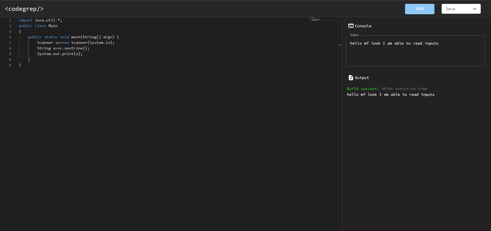

# CPE Online Compiler.
Welcome to CPE Online Compiler.
CPE is an open source online code compiler for C, C++, Python, Java.

### Funactionality
- Free and fast compiler
- Wide language support
- Error at which line is shown
- Output formatted
- Comments

### to-do :
-  user input read

