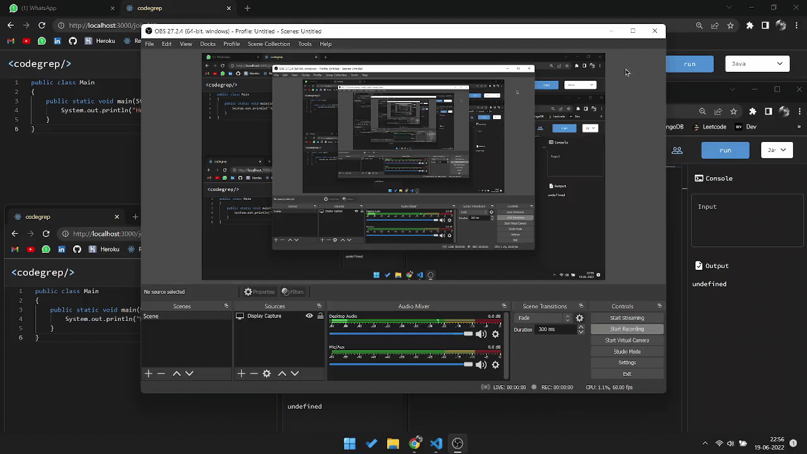

# Codegrep Online Compiler.
Welcome to Codegrep Online Compiler.
Codegrep is an open source online code compiler for C , C++ , Python , Java.
<!-- ##### aws deploted link : http://3.73.119.14:3000 -->
##  Features 
##### *Realtime code collaboration with multiple users* , Error shown at which line ,  Output formatted , Comments , Syntax Highlight , Dark / light mode , Auto indent , Execution time

## On Built Features
##### Login/signup, save code ,download code


## Prerequisites
Make sure you have installed all of the following prerequisites on your development machine:
* Git - [Download & Install Git](https://git-scm.com/downloads). OSX and Linux machines typically have this already installed.
* Node.js - [Download & Install Node.js](https://nodejs.org/en/download/) and the npm package manager. If you encounter any problems, you can also use this [GitHub Gist](https://gist.github.com/isaacs/579814) to install Node.js.
* Java JDK - [Download & Install JDK](https://www.oracle.com/java/technologies/downloads/)
* Python - [Download & Install Python](https://www.python.org/downloads/)
* GCC - [Download & Install GCC](https://sourceforge.net/projects/mingw/)

```bash
$ npm install 
```

## Downloading Codegrep
There are several ways you can get the Codegrep:

### Cloning The GitHub Repository
The recommended way to get Codegrep is to use git to directly clone the Codegrep repository:

```bash
$ git clone https://github.com/nisabmohd/codegrep
```

This will clone the latest version of the codegrep repository to a **codegrep** folder.

### Downloading The Repository Zip File
Another way to use the Codegrep boilerplate is to download a zip copy from the [master branch on GitHub](https://github.com/nisabmohd/codegrep/archive/refs/heads/master.zip).


## Quick Install
To install the dependencies, run this in both client and backend folder from the command-line:
```bash
$ npm install
```


## Running Your Application

Run your application using npm:

&#8594; server start
```bash
$ cd backend
$ node server
```

&#8594; client start
```bash
$ cd client
$ npm start
```


* Your client application should run on port 3000 with the *development* environment configuration, so in your browser just go to [http://localhost:3000](http://localhost:3000)

* Your server application should run on port 8000, so in your browser just go to [http://localhost:8000](http://localhost:3000)


## Overview


#### *Realtime code collaboration* : 



